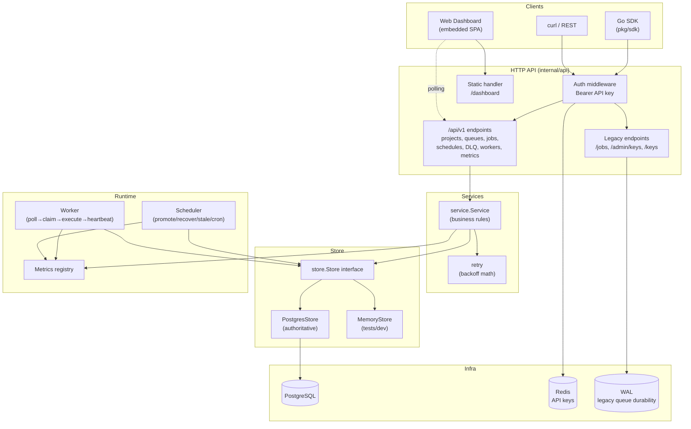

# Architecture Diagram

## Flow

1. Clients authenticate with `Authorization: Bearer <api-key>` (Redis-backed).
2. `/api/v1` requests hit `service.Service`, which enforces project/owner authorization and
   delegates persistence to the `Store`.
3. `PostgresStore` performs atomic claiming (`FOR UPDATE SKIP LOCKED`), pagination, and lifecycle
   transitions against PostgreSQL.
4. The `Scheduler` and `Worker` background loops drive due-job promotion, lease recovery, stale
   worker detection, cron firing, and job execution.
5. The dashboard polls `/api/v1` for live updates (no WebSockets required).
