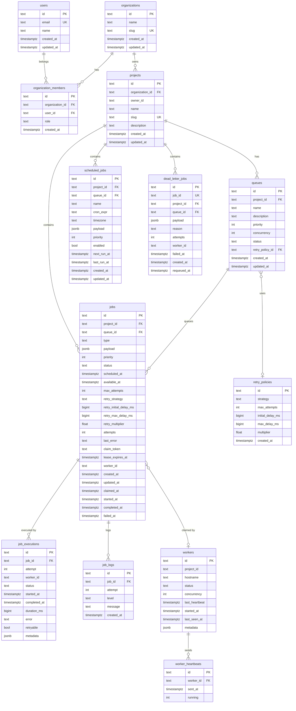

# ER Diagram

## Key relationships

- A **project** owns many **queues**; a queue owns many **jobs**.
- A **queue** references a **retry_policy**; jobs snapshot the policy at submission time so history
  is preserved if the queue's policy later changes.
- Each **job** has many **job_executions** (one per attempt) and many **job_logs**.
- A **worker** records many **worker_heartbeats**; jobs reference the worker that claimed them.
- **dead_letter_jobs** is keyed by `job_id` (one entry per permanently-failed job) and retains the
  payload, failure reason, attempt count, worker, and timestamps.

## Notes

- `ON DELETE CASCADE` is used for child-of-project tables (`queues`, `jobs`, `scheduled_jobs`,
  `dead_letter_jobs`) and child-of-job tables (`job_executions`, `job_logs`).
- `jobs.payload` is `jsonb`; timestamps are `timestamptz`; delays are stored as milliseconds
  (`bigint`) for deterministic retry math.
